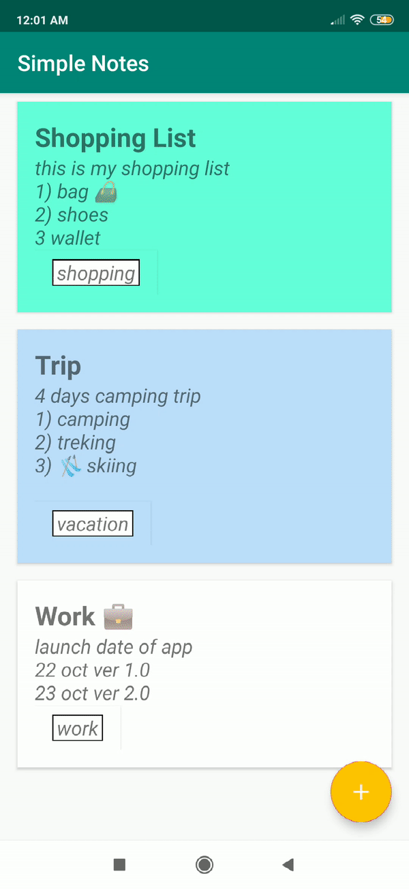

# Simple-Notes-App
 application prise de Notes
 
 
Objectifs : create 📝 edit and ❌ delete notes too. 
Archituctures : Mvvm architecture.

Langage : Kotlin

Fonctionnalités :

Add Note
Delete Note
Edit Note

Aperçu : 

Add 
 
 Edit 

Delete 
 

Libraries :

Room
Viewmodel
Livedata
Dagger2
Dagger Android
Coroutines
Material library
Navigation Component
Safe Args Plugin
  
  
  

